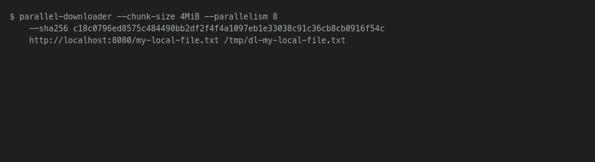
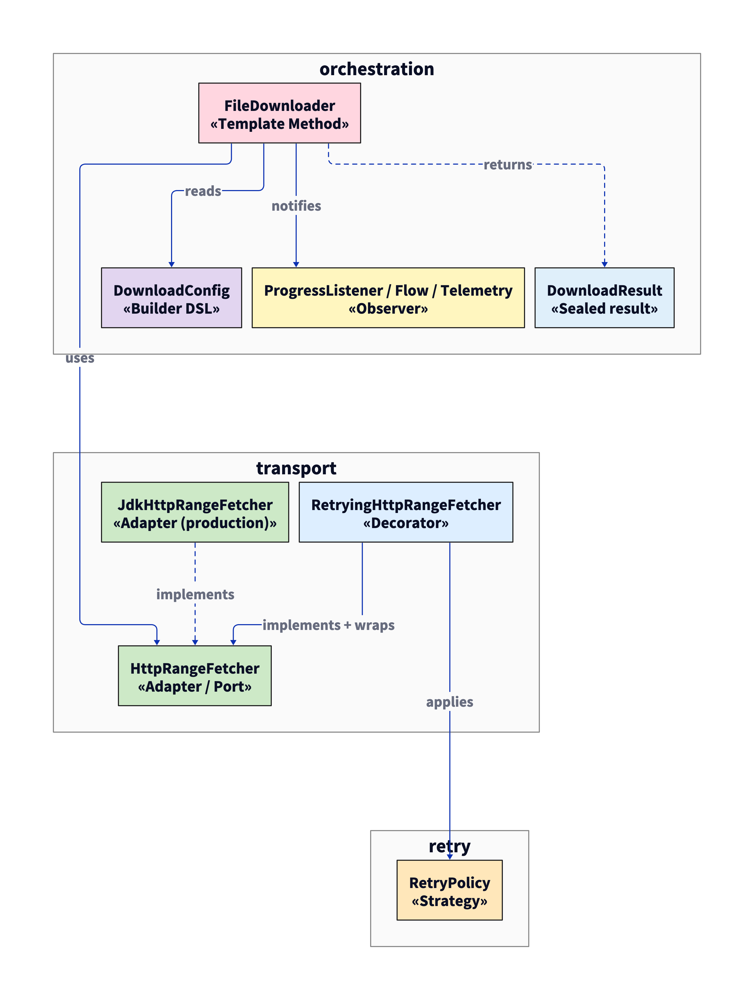

# parallel-downloader

<!-- Replace OWNER/REPO with the GitHub path once this repo is pushed. The codecov
     badge stays grey until the repo is connected at https://about.codecov.io/. -->
[](https://github.com/OWNER/REPO/actions/workflows/ci.yml)
[](https://codecov.io/gh/OWNER/REPO)

A Kotlin CLI and library for downloading a single HTTP(S) file as N parallel byte-range GETs,
streaming each chunk to disk through positional `FileChannel` writes, with single-GET fallback
when the server doesn't advertise `Accept-Ranges`.

|                |                                                                           |
| -------------- | ------------------------------------------------------------------------- |
| Build          | Kotlin 2.0.21, JDK 17 toolchain, Gradle 8 (wrapper checked in)            |
| Runtime deps   | `kotlinx-coroutines-core` only - no other JARs on the classpath           |
| Test surface   | 122 unit/integration tests (incl. 8 jqwik properties) + 8 stress scenarios |
| Coverage gate  | 90% line, 85% branch (JaCoCo, wired into `gradle check`)                  |
| Static checks  | detekt 1.23.7 on the default ruleset; `allWarningsAsErrors=true`          |
| CI             | GitHub Actions runs `./gradlew check` on every push and PR to `main`; the stress suite runs on demand via the `stress` PR label or `workflow_dispatch` |

> The deep dive - design patterns, concurrency model, design forks, failure taxonomy, resume
> protocol, test matrix, coverage gate - is in **[docs/DESIGN.md](docs/DESIGN.md)**.

---

## Demo

50 MiB file, 8 ranged GETs at parallelism 8, fetched from a local Apache `httpd`:



The GIF is rendered from real CLI output - the 138.71 MiB/s figure on the final tick and the
SHA-256 verification at the end are from one observed run, not synthesized. The Docker `httpd`
reproducer (`dd` for the source file, `gradlew installDist` for the binary) lives in
[docs/DESIGN.md#demo-reproducer](docs/DESIGN.md#demo-reproducer); the GIF renderer is at
[docs/make_demo_gif.sh](docs/make_demo_gif.sh).

## Quick start

```bash
./gradlew build         # compile, detekt, 122 tests, JaCoCo gate
./gradlew test          # 122 tests, ~2s warm
./gradlew stressTest    # 8 scenarios under -Xmx256m, ~30s
./gradlew installDist   # builds ./build/install/parallel-downloader/bin/parallel-downloader
```

CLI: `parallel-downloader URL DEST [--chunk-size 8MiB] [--parallelism 8] [--retries 3]
[--sha256 HEX] [--rate-limit RATE]`.
Progress is written to stderr at ~10 Hz. Exit codes: `0` ok, `1` HTTP-level failure (or
`--sha256` mismatch on success), `2` local I/O failure, `64` usage error.

`--sha256 HEX` (64 hex chars) verifies the downloaded file's content against the expected
hash; on mismatch the CLI prints `checksum mismatch: expected X, got Y` to stderr and
exits 1.

`--rate-limit RATE` caps total throughput across all chunks. Accepts the same suffixes as
`--chunk-size` plus an optional `/s` or `/sec` (e.g. `5MB/s`, `1MiB/s`, `512KB`, `1024`).
Semantics are leaky-bucket: idle periods don't accumulate burst credit.

Library use:

```kotlin
val downloader = FileDownloader(
    RetryingHttpRangeFetcher(JdkHttpRangeFetcher(), ExponentialBackoffRetry(maxAttempts = 3))
)
val result: DownloadResult = downloader.download(
    URL("https://example.com/big.bin"),
    Path.of("/tmp/big.bin"),
    downloadConfig { chunkSize = 8.MiB; parallelism = 8 }
)
```

## Architecture

[](docs/architecture.svg)

> Click for the [SVG](docs/architecture.svg) (sharp at any zoom). Source:
> [docs/architecture.d2](docs/architecture.d2).

| Component                  | Pattern         | Role |
| -------------------------- | --------------- | ---- |
| `FileDownloader`           | Template Method | Orchestrates `validate -> probe -> preallocate -> executeChunks -> verifyLength -> finalize`. |
| `HttpRangeFetcher` (port)  | Adapter         | The only HTTP seam; `JdkHttpRangeFetcher` wraps `java.net.http.HttpClient`. |
| `RetryingHttpRangeFetcher` | Decorator       | Wraps any `HttpRangeFetcher`; applies a `RetryPolicy`. |
| `RetryPolicy`              | Strategy        | `ExponentialBackoffRetry` (CLI default) or `NoRetry`. |
| `DownloadConfig`           | Builder DSL     | `downloadConfig { chunkSize = 8.MiB; resume = true }`. |
| `ProgressListener` / `downloadAsFlow` | Observer | Push (callback) and pull (`Flow<ProgressEvent>`). |
| `DownloadResult`           | Sealed result   | `Success` / `HttpError` / `LengthMismatch` / `IoFailure` / `Cancelled` / `RangeNotSupported`. |

Each pattern is named at its implementation site - `grep -r "Pattern:" src/main/kotlin` lists
all seven. Tradeoffs ("why a Decorator and not retry-in-the-orchestrator?", "why a sealed result
and not exceptions?") are documented in [DESIGN.md](docs/DESIGN.md#design-forks-and-the-call-it-made).

### Concurrency

```kotlin
coroutineScope {
    val gate = Semaphore(config.parallelism)
    plan.map { chunk ->
        async(Dispatchers.IO) { gate.withPermit { fetchAndWriteChunk(chunk) } }
    }.awaitAll()
}
```

The `Semaphore` permit is held for the full `fetchRange` suspension, so the bound applies to
in-flight HTTP requests rather than just dispatcher-slot occupancy. (`Dispatchers.IO.limitedParallelism`
would release its slot when the body read suspends, letting in-flight requests grow unbounded —
see [DESIGN.md#concurrency-model](docs/DESIGN.md#concurrency-model).) `FileChannel.write(ByteBuffer,
position)` is documented thread-safe for positional writes, so disjoint chunks need no locking.
Per-chunk transport buffer is 64 KiB; total memory is `O(parallelism * 64 KiB)`, not `O(file size)`
— validated by the stress harness streaming a 1 GiB download under a 256 MiB heap cap.

## Resume

```kotlin
FileDownloader(fetcher).download(url, dest, downloadConfig { resume = true })
```

A sidecar at `<dest>.partial` records the chunk geometry and the server's `ETag` (or
`Last-Modified`). On a later call with the same destination, the orchestrator re-probes the
server, validates the recorded entity tag against the current one, and re-fetches only the
missing chunks. On validator mismatch the sidecar and partial file are discarded - splicing two
file versions would be silent corruption. Format and protocol details:
[DESIGN.md#resume-protocol](docs/DESIGN.md#resume-protocol).

## What's tested

- **Chunk-math boundaries:** `1`, `chunkSize-1`, `chunkSize`, `chunkSize+1`, `N*chunk`,
  `N*chunk+1`, multi-chunk - the standard fence-post conditions for any chunked-IO function.
  Backed by 8 jqwik properties that exercise the algebraic invariants (contiguity, no gaps,
  total coverage, ceil chunk-count) across 1000 random `(totalBytes, chunkSize)` pairs each.
- **Server misbehavior:** 4xx/5xx at probe and chunk phase; 200 to a Range request; wrong
  `Content-Range`; truncated body retried successfully; length-mismatch in single-GET fallback.
- **Concurrency:** observed in-flight count > 1; high-parallelism (64 small chunks); slow chunk
  doesn't block siblings.
- **Cancellation:** parent-job cancellation deletes the partial file; listener receives
  `Cancelled`; 50-iteration cleanup test.
- **If-Range protection:** mid-download file change surfaces as
  `HttpError(200, CHUNK)` instead of silent splice.
- **Resume:** restart skips completed chunks; validator mismatch discards partial work.
- **Stress (separate `stressTest` task, `-Xmx256m`):** 1 GiB streaming download; 1024 chunks at
  parallelism 32; throttled-server timing; retry-budget chaos; mid-stream disconnect recovery;
  1000-iteration leak hunt; 50-iteration cancellation cleanup.

The non-stress suite runs against a real `com.sun.net.httpserver.HttpServer` test fake with
fault-injection knobs; the stress suite uses an embedded Jetty (necessary at the
`chunkSize=8 MiB / parallelism=16` geometry, where the JDK stdlib server deadlocks under load).

## Privacy

The downloader is built to be telemetry-quiet: no `User-Agent` / `Referer` /
`Cookie` / `Authorization` / `From` headers, no env reads beyond `user.home`/`tmpdir`
and friends, no telemetry beacons. The full policy lives in
[PRIVACY.md](PRIVACY.md); [`AnonymityTest`](src/test/kotlin/com/example/downloader/AnonymityTest.kt)
asserts each claim against real production code paths and runs as part of `gradle check`.

Two layered checks enforce this on every change:

- **`./gradlew piiScan`** — static regex pass over `src/main`, `src/test`,
  `src/stressTest`, `src/bench` for emails, non-loopback IPs, identifying env reads,
  hardcoded user paths, and `InetAddress.getLocalHost`. Wired into `gradle check`.
  Test fixtures live in `src/test/resources/piiscanner-fixtures/`.
- **LLM PII review** (`.github/workflows/llm-pii-review.yml`) — sends each PR's
  changed `.kt` / `.kts` / `.java` / `.yml` / `.md` patch to Claude using the
  prompt at [`prompts/pii_review.md`](prompts/pii_review.md) and posts a single
  PR comment if anything is found. Catches the shape-rather-than-string cases
  the static scanner can't (e.g. log statements that interpolate the URL host).

  The prompt is the load-bearing artifact; it's been rehearsed on four
  synthetic diffs with the structured output captured in
  [`prompts/rehearsal-examples.md`](prompts/rehearsal-examples.md). Enable by
  setting an `ANTHROPIC_API_KEY` repository secret. Without the secret the
  workflow logs `ANTHROPIC_API_KEY not configured, skipping LLM PII review.`
  and exits 0 — CI stays green, no comment is posted.

## Limitations

- Per-chunk retry replays bytes from the chunk's start. `If-Range` is on by default whenever
  the server advertises a validator, so a mid-download file change fails loudly via
  `HttpError(200, CHUNK)` rather than splicing two versions.
- Single-GET fallback isn't retried. The retry decorator sits at the fetcher layer, but the
  fallback path is reserved for servers that don't advertise `Accept-Ranges` - those tend to
  be either reliable static-file servers or fundamentally broken.
- HTTPS uses JDK defaults. No custom certificate or hostname-verification hooks.
- The suspend `download()` rethrows `CancellationException` per structured concurrency.
  Listener-based UIs see a synthetic `Finished(Cancelled)` event so they can distinguish
  cancelled-vs-failed without observing the exception.
